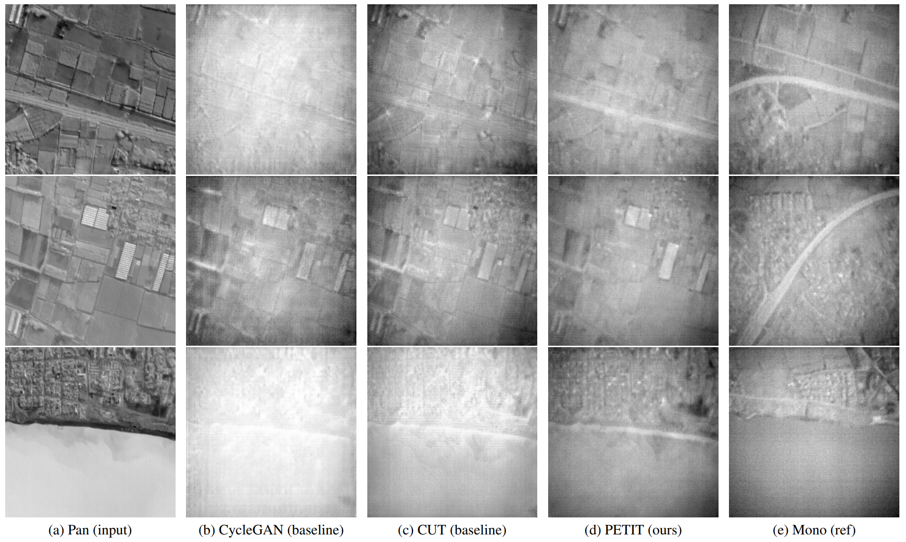

# 
PETIT-GAN: Physically Enhanced Thermal Image-Translating Generative Adversarial Network

### 
In WACV 2024

### 
[code](https://github.com/bermanz/PETIT) |   [paper](TODO) |   [dataset](TODO)

 

</img>

 

# Abstract 
Thermal multispectral imagery is imperative for a plethora of environmental applications.
Unfortunately, there are no publicly-available datasets of thermal multispectral images with a high spatial resolution that would enable the development of algorithms and systems in this field.
However, image-to-image (I2I) translation could be used to artificially synthesize such data by transforming largely-available datasets of other visual modalities.
In most cases, pairs of content-wise-aligned input-target images are not available, making it harder to train and converge to a satisfying solution.
Nevertheless, some data domains, and particularly the thermal domain, have unique properties that tie the input to the output that could help mitigate those weaknesses.
We propose PETIT-GAN, a physically enhanced thermal image-translating generative adversarial network to transform between different thermal modalities - a step toward synthesizing a complete thermal multispectral dataset.
Our novel approach embeds physically modeled prior information in an UI2I translation to produce outputs with greater fidelity to the target modality.
We further show that our solution outperforms the current state-of-the-art architectures at thermal UI2I translation by approximately $50\%$ with respect to the standard perceptual metrics, and enjoys a more robust training procedure.

